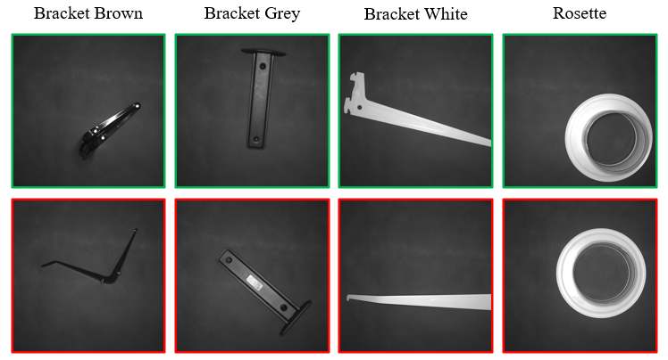

# Metal Parts Defect Detection Dataset 2 (MPDD2)


MPDD2 is a dataset aimed at benchmarking visual defect detection methods in industrial metal parts manufacturing. It consists of more than 700 images, which are divided into the training subset with anomaly-free samples and the validation subset that contains both normal and anomalous samples. The dataset can be downloaded at the following link.

<a id="raw-url" href="https://drive.google.com/drive/folders/1KAJfPPuusS4fEbPocHtIjLehCkpSEUSS?usp=sharing">Download link</a>

## Paper
See the full paper at the <a id="raw-url" href="https://ieeexplore.ieee.org/abstract/document/9943437">following link</a>



## Citing
If you use the dataset in this repository, please cite
```
@INPROCEEDINGS{9943437,
  author={Jezek, Stepan and Jonak, Martin and Burget, Radim and Dvorak, Pavel and Skotak, Milos},
  booktitle={2022 14th International Congress on Ultra Modern Telecommunications and Control Systems and Workshops (ICUMT)}, 
  title={Anomaly detection for real-world industrial applications: benchmarking recent self-supervised and pretrained methods}, 
  year={2022},
  volume={},
  number={},
  pages={64-69},
  doi={10.1109/ICUMT57764.2022.9943437}
}
```

## Contant to authors
Stepan Jezek: <a href="mailto:Stepan.Jezek1@vut.cz">Stepan.Jezek1@vut.cz</a>
Radim Burget: <a href="mailto:burgetrm@vutbr.cz">burgetrm@vut.cz</a>

## Acknowledgments

This work was supported by project "Defectoscopy of painted parts using automatic adaptation of neural networks", FW03010273, Technology Agency of the Czech Republic

<a id="raw-url" href="https://www.vut.cz/en/">Brno University of Technology</a>
